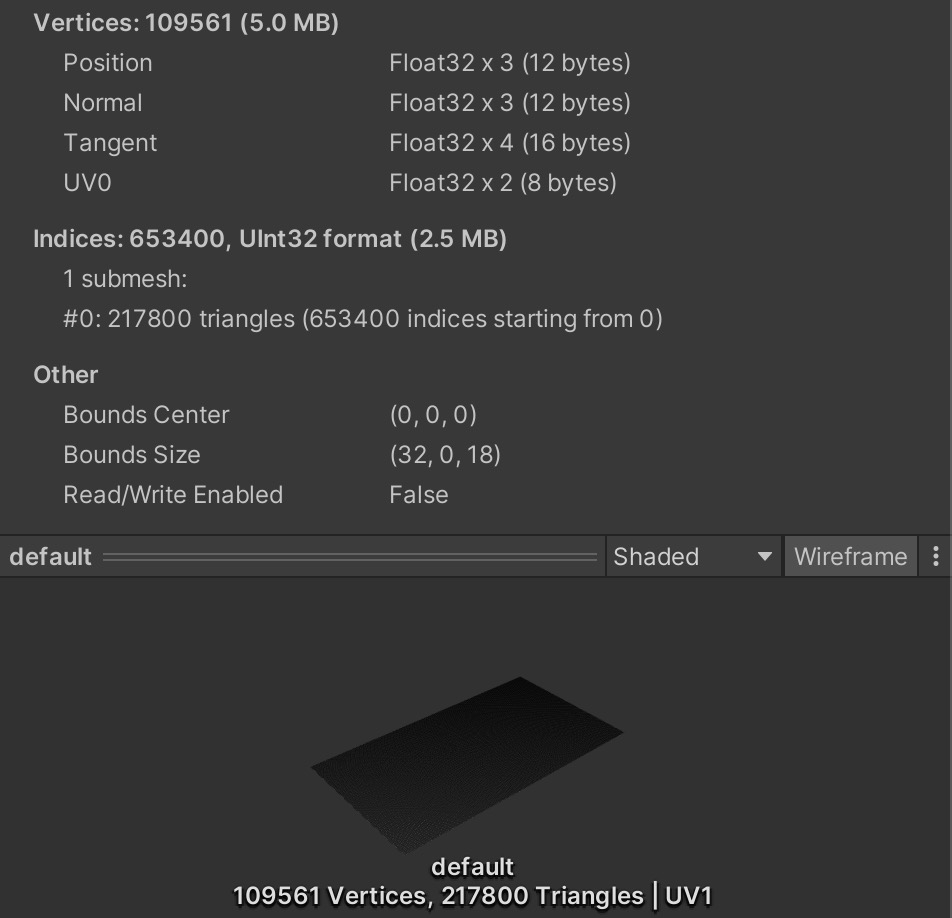
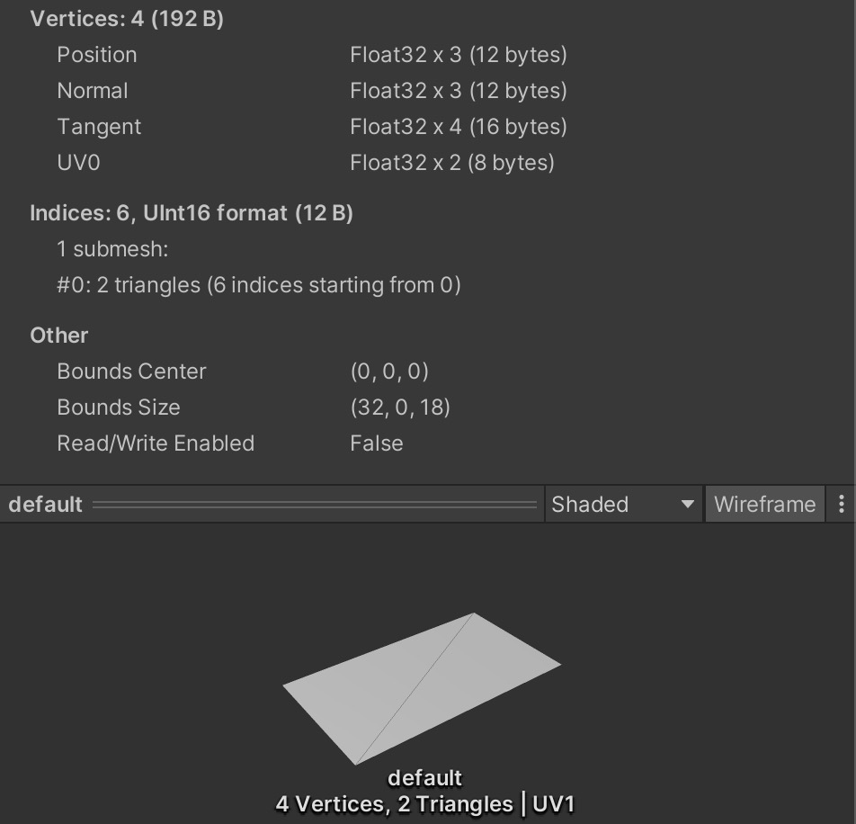

  

В Минском Юнити комьюнити зашел разговор о производительности рендеринга на мобильных платформах. Изначально вопрос ставился как “какой поликаунт допустим на мобилах”, и помимо стандартного ответа “зависит много от чего и в целом поликаунт не главное” фигурировали также интересные ссылки на советы от разработчиков популярных ГПУ (Mali, PowerVR и т.д.).

Ссылки на почитать можно найти в этом крутом телеграм канале: https://t.me/log_gpo

Других дел на вечер, конечно же, не нашлось, поэтому родилась идея сделать небольшой синтетический тест и погонять его на моем старичке (седьмом айфоне).

Unity 2020.3.20f1, iPhone 7, релизный билд, Metal, Forward Rendering, Clear Flags на камере в Solid Color, Color Space - Gamma, тени отключены, одна directional лампочка.

Поехали.

## Тесты
- Меш на 200к трисов с Unlit/Color шейдером - максимально простой материал для разгрузки фрагментного шейдера, тестим чисто поликаунт
- Меш на 2м трисов - первый вариант на стероидах
- 4, 16 и 32 полупрозрачных квада, для любителей говорить о том, как альфа убивает мобилы (убивает, но не из-за альфа-блендинга, а из-за филлрейта, об этом ниже)
- 4 полупрозрачных квада и 8 источников света
- 1 opaque квад с 64 источниками света, стандарт шейдер без отражений, только с цветом и светом
- 1 opaque квад с 64 источниками света, стандарт шейдер с полным набором PBR текстур для усложнения расчетов во фрагментном шейдере

Текстуры для последнего теста были пожаты в размер 256 пикселей, чтобы гарантированно не утыкаться в гпу кеш и шину (тут мы тестим только поликаунт vs филлрейт).
Текстуры: Albedo, Metalness, Normal, Height, AO. Сорян, сегодня без Detail и Emissive.
Также в настройках проекта был выставлен Pixel Light Count в 64. Я не копался в стандарт шейдере (может он сам по себе фоллбечит на vertex lit на мобилах когда лампочек много), но судя по фрейм дебаггеру - все нарм, и все доп пассы по свету отрабатывали честно.

Фотки мешей в юнити:

  
  
  

### Сразу результаты, для любопытных, но ленивых:

|Test|Avg frame time|Min frame time|Max frame time
|-------------|-------------|-------------|-------------
| 200k mesh |  16.6ms | 16.6ms | 16.6ms
| 2m mesh | 16.6ms | 16.6ms | 16.6ms
| 4 quads | 16.6ms | 16.6ms | 16.6ms
| 16 quads | 16.6ms | 16.6ms | 16.6ms
| 32 quads | 16.6ms | 16.6ms | 16.6ms
| 4 quads 8 lights | 16.6ms | 16.6ms | 16.6ms
| 1 quad 64 lights | 28.8ms | 16.6ms | 33.77ms
| 1 tex quad 64 lights | 36ms | 16.6ms | 67.8ms

### Гифонька (потрепала жизнь чутка, очень жаль):

Собственно по гифке выше видно, что седьмой айфон прекрасно и с запасом переваривает как сингл меш с 2м трисов на экране, так и 32 фуллскрин (почти) плашки с альфой.
4 квада с 64 лампочками напрягают деда сильнее, и это логично, т.к. даже с простым по вычислениям шейдером такое количество фрагментов переварить сложнее.
Ну и самый печальный перформанс, ожидаемо, показал последний тест, в котором фрагментному шейдеру приходилось переваривать кучу bsdf вычислений.

Еще я залез в Metal Debugger в икскоде и сделал пару скринов оттуда. Полюбуйтесь:

Меш с 200к трисов. Нагрузка на вершинный шейдер есть, но не очень большая:

  

Меш с 2м трисов. Нагрузка на вершинный шейдер сильная, но это 2 миллиона трисов в кадре:

  

32 полупрозрачных квада. Сильная нагрузка на фрагментный шейдер из-за очень сильного overdraw:

  

Квад с 64 лампочками. Дед напрягся:

  

Квад с текстурами и 64 лампочками. Тут полномочия семерки уже все:

  

### Выводы:
Выводы тут делать глупо, тест ничего не показывает. Расслабьтесь и получайте удовольствие.

### TODO:
Можно еще в гигамеш насовать вершинных атрибутов побольше (нормал, колор, текскоордов), чтобы посмотреть, уткнется ли интерполятор. Тоже интересно.
